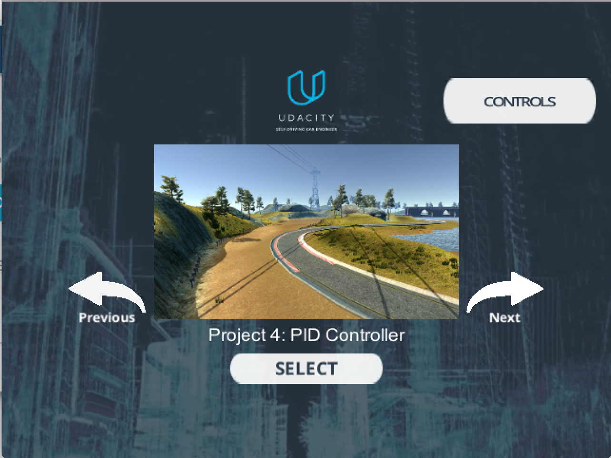
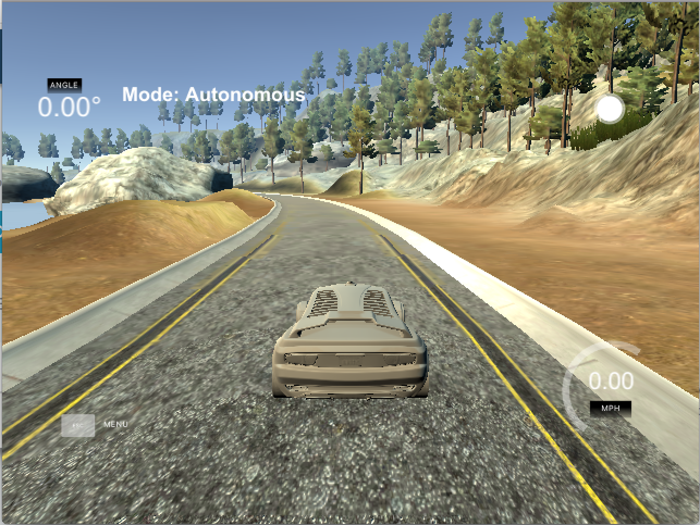

# CarND-Controls-PID
Self-Driving Car Engineer Nanodegree Program

---

## Dependencies

* cmake >= 3.5
 * All OSes: [click here for installation instructions](https://cmake.org/install/)
* make >= 4.1(mac, linux), 3.81(Windows)
  * Linux: make is installed by default on most Linux distros
  * Mac: [install Xcode command line tools to get make](https://developer.apple.com/xcode/features/)
  * Windows: [Click here for installation instructions](http://gnuwin32.sourceforge.net/packages/make.htm)
* gcc/g++ >= 5.4
  * Linux: gcc / g++ is installed by default on most Linux distros
  * Mac: same deal as make - [install Xcode command line tools]((https://developer.apple.com/xcode/features/)
  * Windows: recommend using [MinGW](http://www.mingw.org/)
* [uWebSockets](https://github.com/uWebSockets/uWebSockets)
  * Run either `./install-mac.sh` or `./install-ubuntu.sh`.
  * If you install from source, checkout to commit `e94b6e1`, i.e.
    ```
    git clone https://github.com/uWebSockets/uWebSockets 
    cd uWebSockets
    git checkout e94b6e1
    ```
    Some function signatures have changed in v0.14.x. See [this PR](https://github.com/udacity/CarND-MPC-Project/pull/3) for more details.
* Simulator. You can download these from the [project intro page](https://github.com/udacity/self-driving-car-sim/releases) in the classroom.

There's an experimental patch for windows in this [PR](https://github.com/udacity/CarND-PID-Control-Project/pull/3)

## Basic Build Instructions

1. Clone this repo.
2. Make a build directory: `mkdir build && cd build`
3. Compile: `cmake .. && make`
4. Run it: `./pid`. 

Tips for setting up your environment can be found [here](https://classroom.udacity.com/nanodegrees/nd013/parts/40f38239-66b6-46ec-ae68-03afd8a601c8/modules/0949fca6-b379-42af-a919-ee50aa304e6a/lessons/f758c44c-5e40-4e01-93b5-1a82aa4e044f/concepts/23d376c7-0195-4276-bdf0-e02f1f3c665d)

## Running the Simulation

After starting the simulation, pick the `Project 4: PID Controller`



This how the simulation will look like:



## Rubric Points

#### Describe the effect of the P, I, D component of the PID algorithm in your implementation.

P, the proportional, component had a direct effect on the steering angle. It causes the car to steer proportionatly to the cars distance to lane center: if the car is far away from the lane center then it steers hard to wards the center and steers slighty if close to the center.

I, the integral, component corrects the incorrect convergence of a PD controller. For example around the corners the I component really helped reduce the CTE.

D, the differential, will counteract the P component from over shooting passed the center. Based on the rate of change of CTE, the D component smooths out the cars approach to center.

#### Discusses how you chose the final hyperparameters (P, I, D coefficients).

I tuned the parameters manually. After doing some reading online, I came accross an algorithm for tuning the PID parameters manually. The algorithm goes as follows:

1. Set all gains to zero.
2. Increase the P gain until the response to a disturbance is steady oscillation.
3. Increase the D gain until the the oscillations go away (i.e. it's critically damped).
4. Repeat steps 2 and 3 until increasing the D gain does not stop the oscillations.
5. Set P and D to the last stable values.
6. Increase the I gain until it brings you to the setpoint with the number of oscillations desired (normally zero but a quicker response can be had if you don't mind a couple oscillations of overshoot)


I also implemented a PID controller for the throthle with CTE as the error. The reason CTE is the error is because we want the car's speed to decrease if its too far from the center. 